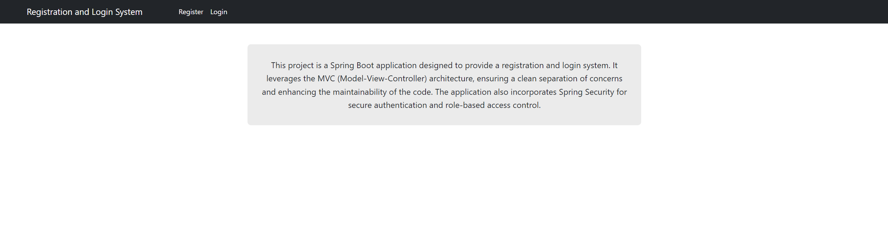
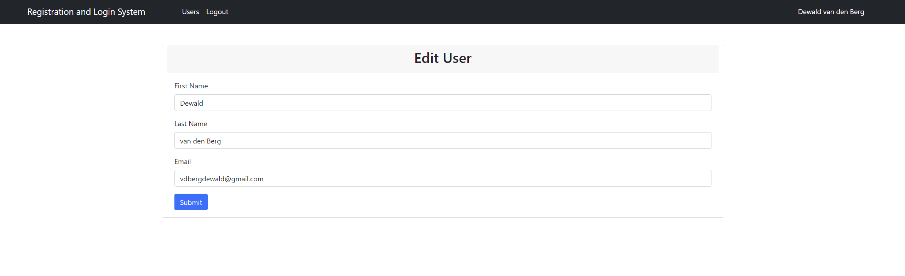
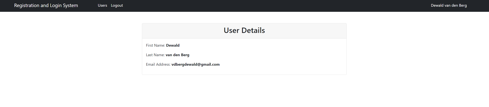

# Registration and Login System

This is a Java Spring Boot application that provides a registration and login system for users. It allows users to register with their first name, last name, email, and password, and then log in with their email and password. Once logged in, users with the admin role can view a list of all registered users.

## Table of Contents

1. [Project Structure](#project-structure)
2. [Getting Started](#getting-started)
4. [Application Flow](#application-flow)
5. [Configuration](#configuration)
6. [Security Configuration](#security-configuration)
7. [Service Layer](#service-layer)
8. [Repository Layer](#repository-layer)
9. [Entity Classes](#entity-classes)
10. [DTO Classes](#dto-classes)
11. [Controller Classes](#controller-classes)
12. [View Layer](#view-layer)
13. [Building and Running the Application](#building-and-running-the-application)
14. [Screenshots](#screenshots)

## Prerequisites

- Java Development Kit (JDK) 22
- MySQL Server
- Maven

## Technologies Used

- Spring Boot 3.3.0
- Spring Data JPA
- Thymeleaf
- Spring Security
- MySQL
- Lombok

## Project Structure

```bash
Registration-Login-System
├── src
│   ├── main
│   │   ├── java
│   │   │   └── com
│   │   │       └── dee
│   │   │           └── registration_login_system
│   │   │               ├── config
│   │   │               │   ├── CustomAuthenticationSuccessHandler.java
│   │   │               │   └── SpringSecurity.java
│   │   │               ├── controller
│   │   │               │   └── AuthController.java
│   │   │               ├── dto
│   │   │               │   └── UserDto.java
│   │   │               ├── entity
│   │   │               │   ├── Role.java
│   │   │               │   └── User.java
│   │   │               ├── repository
│   │   │               │   ├── RoleRepository.java
│   │   │               │   └── UserRepository.java
│   │   │               ├── security
│   │   │               │   └── CustomUserDetailsService.java
│   │   │               ├── service
│   │   │               │   ├── UserService.java
│   │   │               │   └── impl
│   │   │               │       └── UserServiceImpl.java
│   │   │               └── RegistrationLoginSystemApplication.java
│   │   └── resources
│   │       ├── static
│   │       ├── templates
│   │       │   ├── index.html
│   │       │   ├── login.html
│   │       │   ├── register.html
│   │       │   └── users.html
│   │       └── application.properties
│   └── test
│       └── java
│           └── com
│               └── dee
│                   └── registration_login_system
│                       └── RegistrationLoginSystemApplicationTests.java
└── pom.xml
```

## Getting Started

1. Clone the repository or download the source code.
2. Import the project into your preferred IDE (e.g., IntelliJ IDEA, Eclipse).
3. Create a MySQL database named `registration_db`.
4. Update the `application.properties` file with your MySQL server credentials.
5. Run the application using the `RegistrationLoginSystemApplication` class.
6. Access the application at [http://localhost:8080/index](http://localhost:8080/index).

## Application Flow

### Registration
- Users can register by providing their first name, last name, email, and password.
- Upon successful registration, they will be redirected to the login page.

### Login
- Users can log in using their registered email and password.
- Upon successful login:
    - Users with the admin role will be redirected to the users page.
    - Regular users will be redirected to the index page.

### Users Page
- Accessible only to users with the admin role.
- This page displays a list of all registered users, including their first name, last name, and email.

### Logout
- Users can log out from the application by clicking the "Logout" link in the navigation menu.

## Configuration

The `application.properties` file contains the following configuration:

```properties
# Spring Application Name
spring.application.name=student-management-system

# MySQL Database Configuration
spring.datasource.url=jdbc:mysql://localhost:3306/registration_db
spring.datasource.username=root
spring.datasource.password=160991

# Hibernate Configuration
spring.jpa.properties.hibernate.dialect=org.hibernate.dialect.MySQLDialect
spring.jpa.hibernate.ddl-auto=update

# Logging Configuration
logging.level.org.springframework.security=DEBUG
```
Update the `spring.datasource.username` and `spring.datasource.password` properties with your MySQL server credentials.

## Security Configuration

The `SpringSecurity` class configures the application's security settings:

- Allows access to the registration page (`/register/**`) without authentication.
- Allows access to the index page (`/index`) without authentication.
- Requires the "ADMIN" role to access the users page (`/users`).
- Configures the login page (`/login`) and login processing URL (`/login`).
- Configures the logout URL (`/logout`).

The `CustomAuthenticationSuccessHandler` class is responsible for redirecting users to the appropriate page after successful authentication, based on their roles.

## Service Layer

The `UserService` interface and `UserServiceImpl` class handle the business logic related to user management:

- `saveUser`: Saves a new user to the database.
- `findUserByEmail`: Retrieves a user by their email address.
- `findAllUsers`: Retrieves a list of all registered users.

## Repository Layer

The `UserRepository` and `RoleRepository` interfaces extend the `JpaRepository` interface from Spring Data JPA, providing CRUD operations for the User and Role entities, respectively.

## Entity Classes

- **User**: Represents a registered user with fields for id, name, email, password, and roles.
- **Role**: Represents a user role with fields for id and name.

## DTO Classes

- **UserDto**: A Data Transfer Object used for transferring user data between the application layers.

## Controller Classes

- **AuthController**: Handles user authentication, including registration, login, and displaying the list of users (for admins).

## View Layer

The application uses Thymeleaf templates for rendering the user interface:

- **index.html**: The home page.
- **register.html**: The registration form.
- **login.html**: The login form.
- **users.html**: The page displaying the list of registered users (accessible to admins).

## Building and Running the Application

To build and run the application, follow these steps:

1. Open a terminal or command prompt.
2. Navigate to the project directory.
3. Run the following command to build the project:

   ```bash
   mvn clean install
    ```
   After a successful build, run the following command to start the application:
    ```bash
   mvn spring-boot:run
    ```
   The application will be accessible at http://localhost:8080.

---

That's it! This documentation should help you understand the structure, functionality, and configuration of the Registration and Login System project.

---

## Screenshots
<div style="text-align: center;">

### 1. **login.html**



### 2. **register.html**


### 3. **index.html**


### 4. **users.html (logged in with ADMIN role)**


### 5. **index.html (logged in with USER role)**



### 6. **login.html (after logout)**


</div>