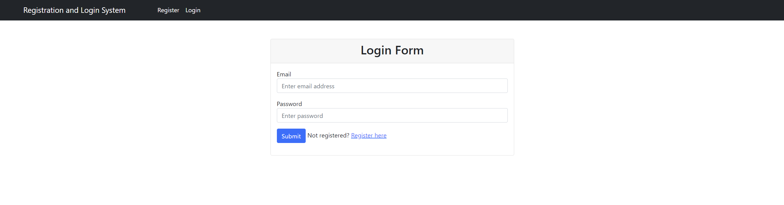
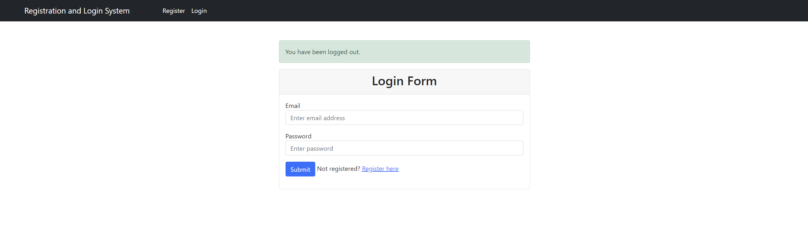

# Registration and Login System

## Overview
This project is a Spring Boot application providing a registration and login system. It manages user roles and provides functionalities for both standard users and administrators.

### Key Features
- **User Registration**: New users can register. The first registered user is assigned the `ROLE_ADMIN` role, and subsequent users receive the `ROLE_USER` role.
- **Authentication and Authorization**: Users can log in and are assigned roles which determine their access rights.
- **Admin Functionality**: Admins can view a list of all users, edit user details, change user roles, and delete users. Admins cannot delete themselves or change their own role.
- **User Functionality**: Standard users can view the user list and edit their own details.

## Table of Contents

1. [Prerequisites](#prerequisites)
2. [Technologies Used](#technologies-used)
3. [Getting Started](#getting-started)
4. [Project Structure](#project-structure)
5. [File Structure](#file-structure)
6. [Detailed Description](#detailed-description)
7. [Endpoints](#endpoints)
8. [Authors](#authors)
9. [Screenshots](#screenshots)

## Prerequisites

- Java Development Kit (JDK) 22
- MySQL Server
- Maven

## Technologies Used

- Java
- Spring Boot 3.3.0
- Spring Data JPA
- Spring Security
- Thymeleaf
- MySQL
- Lombok
- Bootstrap

## Getting Started

1. Clone the repository or download the source code.
2. Import the project into your preferred IDE (e.g., IntelliJ IDEA, Eclipse).
3. Create a MySQL database named `registration_db`.
4. Update the `application.properties` file with your MySQL server credentials.
5. Run the application using the `RegistrationLoginSystemApplication` class.
6. Open a browser and navigate to [http://localhost:8080/index](http://localhost:8080/index) to access the home page.
7. Register a new user to get started. The first user registered will be assigned as `ROLE_ADMIN`.


## Project Structure

```bash
registration-login-system
├── src
│   ├── main
│   │   ├── java
│   │   │   └── com
│   │   │       └── dee
│   │   │           └── registration_login_system
│   │   │               ├── config
│   │   │               │   └── SpringSecurity.java
│   │   │               ├── controller
│   │   │               │   └── AuthController.java
│   │   │               ├── dto
│   │   │               │   └── UserDto.java
│   │   │               ├── entity
│   │   │               │   ├── Role.java
│   │   │               │   └── User.java
│   │   │               ├── repository
│   │   │               │   ├── RoleRepository.java
│   │   │               │   └── UserRepository.java
│   │   │               ├── security
│   │   │               │   ├── CustomUserDetails.java
│   │   │               │   └── CustomUserDetailsService.java
│   │   │               ├── service
│   │   │               │   ├── UserService.java
│   │   │               │   ├── ValidationGroups.java
│   │   │               │   └── impl
│   │   │               │       └── UserServiceImpl.java
│   │   │               └── RegistrationLoginSystemApplication.java
│   │   └── resources
│   │       ├── static
│   │       ├── templates
│   │       │   ├── edit_user.html
│   │       │   ├── index.html
│   │       │   ├── login.html
│   │       │   ├── register.html
│   │       │   ├── users.html
│   │       │   └── view.html
│   │       └── application.properties
│   └── test
│       └── java
│           └── com
│               └── dee
│                   └── registration_login_system
│                       └── RegistrationLoginSystemApplicationTests.java
└── pom.xml
```
### Dependencies

The `pom.xml` file includes essential Spring Boot dependencies such as:

- `spring-boot-starter-data-jpa`
- `spring-boot-starter-thymeleaf`
- `spring-boot-starter-validation`
- `spring-boot-starter-web`
- `spring-boot-starter-security`
- `thymeleaf-extras-springsecurity6`
- `mysql-connector-j`

### Configuration

- **Database**: Configured to use a MySQL database with details provided in `application.properties`.
- **Spring Security**: Configured to handle user roles and permissions as defined in the `SpringSecurity` class.

## File Structure

- src/main/java/com/dee/registration_login_system:
  - **Controllers**: Manages web requests and user interactions (`AuthController`).
  - **Entities**: Defines the data models for User and Role (`User`, `Role`).
  - **DTOs**: Data Transfer Objects used for user data (`UserDto`).
  - **Repositories**: Interfaces for data access operations (`UserRepository`, `RoleRepository`).
  - **Security**: Configuration for security and custom user details service (`SpringSecurity`, `CustomUserDetails`, `CustomUserDetailsService`).
  - **Services**: Business logic and service implementations (`UserService`, `UserServiceImpl`).


- src/main/resources/templates:
  - **Thymeleaf Templates**: HTML templates for user interface (`index.html`, `login.html`, `register.html`, `edit_user.html`, `users.html`).


## Detailed Description

### 1. Application Configuration

- **application.properties**: Contains the configuration settings for the application such as the application name, database connection properties, and logging level for Spring Security.

### 2. Security Configuration

- **SpringSecurity**:
    - Configures the security filter chain and password encoding.
    - Sets up role-based access control, specifying which endpoints are accessible to which roles.
    - Customizes login and logout processes.

### 3. Entity Definitions

- **User**: Represents the user entity with fields for ID, name, email, password, and roles.
- **Role**: Represents the role entity with fields for ID and name. Users can have multiple roles.

### 4. Data Access

- **UserRepository**: Provides CRUD operations for the User entity.
- **RoleRepository**: Provides CRUD operations for the Role entity.

### 5. Service Layer

- **UserService**: Interface defining the operations for user management.
- **UserServiceImpl**: Implementation of `UserService` handling user registration, updates, deletion, and role management.

### 6. Web Layer

- **AuthController**:
    - Manages user registration, login, and profile management.
    - Handles role assignments and user listing for admins.
    - Provides endpoints for changing user roles and viewing user details.

### 7. Custom Security Details

- **CustomUserDetails**: Implements `UserDetails` to include user-specific information like ID and full name.
- **CustomUserDetailsService**: Loads user details from the database for authentication.

### 8. HTML Templates

- **index.html**: Home page template.
- **login.html**: Login form for user authentication.
- **register.html**: Registration form for new users.
- **edit_user.html**: Form for editing user details.
- **users.html**: Admin page for listing and managing users.

## Endpoints

### Public Endpoints

- **GET /index**: Landing page.
- **GET /register**: Shows the registration form.
- **POST /register/save**: Handles new user registration.
- **GET /login**: Shows the login form.

### User Endpoints

- **GET `/users`**: Lists all users (accessible to both ADMIN and USER roles).
- **GET `/user/{userId}/edit`**: Form for editing user details (accessible to ADMIN and the specific USER).
- **POST `/user/{userId}`**: Handles updates to user details.
- **GET `/user/{userId}/view`**: Displays detailed view of a user (accessible to ADMIN).

### Admin Endpoints

- **GET `/user/{userId}/delete`**: Deletes a user (ADMIN only).
- **POST `/user/{userId}/changeRole`**: Changes the role of a user (ADMIN only).

## Authors

Dewald van den Berg - [GitHub](https://github.com/Dewald15)


## Screenshots
<div style="text-align: center;">

### 1. **index.html**


### 2. **register.html**


### 3. **login.html**



### 4. **users.html (logged in with ADMIN role)**


### 5. **edit_user.html**


### 6. **view_user.html**


### 7. **users.html (Change Role Dropdown)**


### 8. **users.html (logged in with USER role)**


### 9. **login.html (after logout)**


</div>